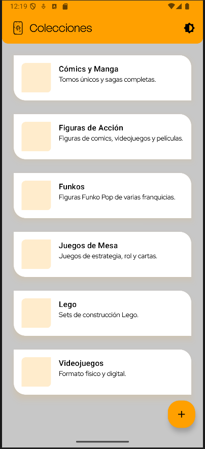
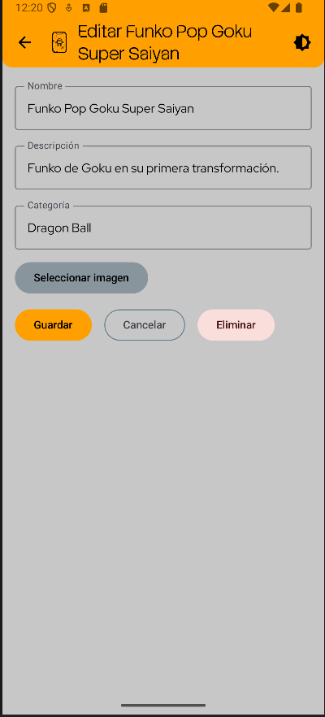
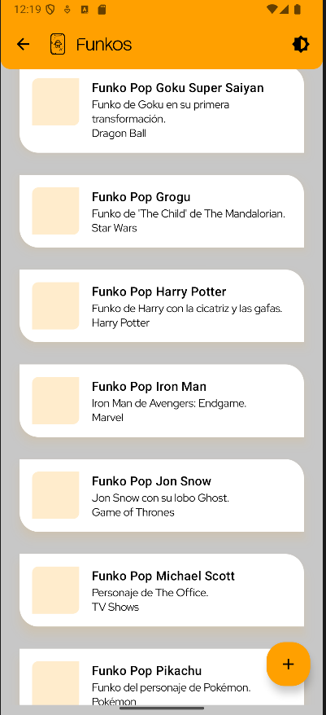

# App de Gestión de Coleccionables

## Descripción del Proyecto
La app empezó siendo una mejor reinterpretación de *TipTime* y *VAT Calculator*, vistos durante las clases, junto al guardado en bases de datos Room. Por eso se me ocurrió hacer una simple app de almacenaje de datos de coleccionables, donde guardar y administrar tus colecciones, sean del tipo que sean.

Trata de una pantalla de lista con tarjetas; cada tarjeta es una colección que contiene el espacio para una futura implementación de imágenes, el nombre de la colección y algunas características. Dentro de cada una habrá otra pantalla de listas con la misma estructura, pero con ítems de dicha colección.

En un futuro se implementará el acceso a cada uno de los ítems para ver imágenes e información ampliada. Todas las tarjetas tienen la función de onClick o mantener pulsado para seleccionar, desde un menú emergente, las opciones de eliminar y editar, el cual completa los campos del formulario con su información para editarla.

## Desarrollo y Estructura del Código
En cuanto al código, empecé modularizando plantillas genéricas con el fin de escalar la aplicación, pero durante el desarrollo surgieron tantos problemas y, con la prisa de entrega del proyecto, acabé separando algunas interfaces. Por ejemplo, `formularioElemento` iba a ser la plantilla para los formularios de colección e ítem, pero acabaron construyéndose independientemente.

También fui encontrando problemas al añadir un icono personalizado en PNG sin eliminar bien el fondo transparente, lo que hizo que Android lo mostrara con sombras extrañas o mal recortado.

Otro problema frecuente fue que **las rutas se rompían a menudo**, sobre todo cuando pasaba parámetros manualmente o cuando cambiaba la estructura de navegación. Esto me obligaba a revisar varias veces la responsabilidad de cada parte de la navegación y ajustar qué componente se encargaba de construir o recibir la ruta correcta. Durante el desarrollo, tuve que cambiar estas dependencias y responsabilidades más de una vez hasta que quedó estable.

Hay algunas clases que terminaron igual, aunque otras, como las pantallas, sí que usan la clase `PantallaLista` como plantilla. Lo mismo ocurre con el TopBar: en los formularios se incluye dentro del `Column`, mientras que en las pantallas de lista lo pasamos con el `Scaffold`.

Estos errores de estructura y desarrollo vienen por el aprendizaje y las prisas de entrega, aunque reconozco que he aprendido mucho en esta pequeña práctica.

## Funcionalidades Principales
- CRUD completo para colecciones y sus ítems (Crear, Leer, Actualizar y Eliminar)
- Menú contextual en tarjetas para editar o eliminar elementos
- Formularios “inteligentes” que detectan si es creación o edición
- Eliminación en cascada de colecciones e ítems asociados
- Navegación robusta con rutas centralizadas en `Rutas.kt`
- Splash Screen al iniciar la app
- Estilos consistentes en modo claro y oscuro

## Guía de Uso

1. **Pantalla principal**
    - Lista todas las colecciones.
    - Pulsar una tarjeta abre la colección.
    - Mantener pulsada una tarjeta para abrir el menú contextual de edición o eliminación.

2. **Dentro de una colección**
    - Lista todos los ítems.
    - Funciona igual que la pantalla de colecciones.
    - Próximamente se podrá acceder a información ampliada e imágenes de cada ítem.

3. **Formularios**
    - Detectan automáticamente si se está creando o editando un elemento.
    - Los campos se rellenan con los datos existentes en modo edición.
    - Botón “Guardar” inserta o actualiza según el modo.
    - Botón “Eliminar” disponible en modo edición para borrar directamente el elemento.

4. **Navegación**
    - Todas las rutas están centralizadas en `Rutas.kt`.
    - Para navegar, se usan constantes y `.replace()` para pasar parámetros de forma segura.

## Capturas de Pantalla

### Colecciones

### Formulario

### Ítems

